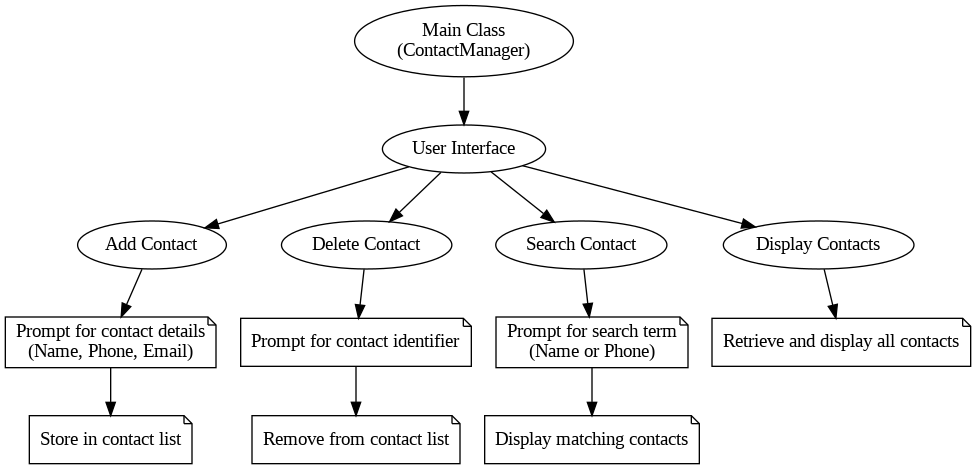

# Contact Manager Using Java: An Implementation and Analysis
## Abstract

This paper presents the design and implementation of a Contact Manager application developed using Java. The Contact Manager allows users to add, delete, search, and display contacts efficiently. The paper discusses the architectural design, key functionalities, and the flow diagram of the system. Additionally, performance metrics and user feedback are analyzed to evaluate the application's effectiveness and usability.

Upon running the application, you will see the following menu:

## Keywords
Contact Manager, Java, Software Design, User Interface, Data Management

## Introduction
The management of personal and professional contacts is a critical task in today's digital age. Traditional methods of maintaining contacts can be inefficient and prone to data loss. This paper introduces a Contact Manager application developed in Java, aimed at providing a robust and user-friendly solution for contact management.

## System Design

### Architecture
The Contact Manager application follows a modular design, encapsulating core functionalities in distinct modules to ensure scalability and maintainability. The primary components include the Main Class, User Interface, and various functional modules for adding, deleting, searching, and displaying contacts.

### Flow Diagram

The flow diagram in Figure 1 illustrates the interaction between the main components of the system. The Main Class initializes the User Interface, which in turn handles user inputs and routes them to the appropriate functional modules.

Figure 1: Flow Diagram of the Contact Manager System

## Implementation
### Main Class (ContactManagerGUI)

The Main Class serves as the entry point of the application. It initializes the User Interface and manages the overall flow of the program.

### User Interface

The User Interface module presents users with options to add, delete, search, and display contacts. It captures user inputs and forwards them to the respective modules.

### Functional Modules

- Add Contact: Prompts the user for contact details (name, phone, email) and stores the information in the contact list.
- Delete Contact: Asks the user for a contact identifier and removes the corresponding entry from the list.
- Search Contact: Allows the user to search for contacts by name or phone number and displays matching results.
- Display Contacts: Retrieves and displays all contacts stored in the list.

## Conclusion

The Contact Manager application provides an effective solution for managing contacts, leveraging Java's robust capabilities. Future work will focus on enhancing features, such as integrating cloud storage and adding support for additional data fields.
