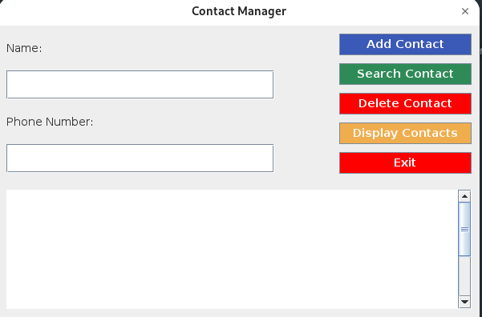

# Contact Manager
This project is a simple Contact Manager application implemented in Java using a Binary Search Tree (BST). The application allows users to add, search, delete, and display contacts. Each contact has a name and a phone number.

## Features
- Add a new contact
- Search for a contact by name
- Delete a contact by name
- Display all contacts in alphabetical order
## Getting Started
### Prerequisites
- Java Development Kit (JDK) installed on your system.
- A Java Integrated Development Environment (IDE) such as IntelliJ IDEA, Eclipse, or NetBeans, or simply a text editor and command line tools.
- Git installed on your system.
### Installation
- Downlaod the repository:
- Open the project in your IDE or text editor.
- Run the Code

## Usage

Upon running the application, you will see the following menu:

## Graph

### Options
- Add Contact: Prompts for a contact name and phone number, then adds the contact to the manager.
- Search Contact: Prompts for a contact name, then searches and displays the contact if found.
- Delete Contact: Prompts for a contact name, then deletes the contact if it exists.
- Display Contacts: Displays all contacts in alphabetical order by name.
- Exit: Exits the application.
